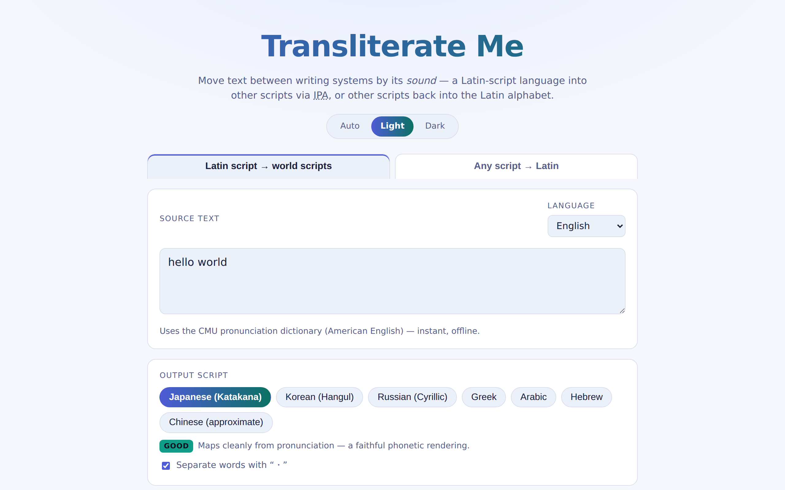

<p align="center">
  
  
</p>

<p align="center">
  <a href="docs/CHANGELOG.md"></a>
  <a href="LICENSE"></a>
  <a href="https://github.com/shamu4life/transliterate-me/actions/workflows/ci.yml"></a>
  
  
  <a href="https://developers.cloudflare.com/workers/static-assets/"></a>
</p>

<p align="center"><b>▶ <a href="https://funny-words.uwutoowo.com/">Try it live</a></b> — no install, runs entirely in your browser.</p>

Move text between writing systems **by its sound**, in two directions:

- **Latin-script language → world scripts.** Type one of **14 languages**
  (English, Spanish, French, German, Italian, Portuguese, Dutch, Polish,
  Catalan, Romanian, Czech, Swedish, Danish, Turkish), see its **IPA
  pronunciation**, and transliterate the *sound* into Japanese, Korean, Russian,
  Greek, Arabic, Hebrew, or (approximately) Chinese. **Numbers are spoken too** —
  `300` becomes “three hundred” (also decimals, years, ordinals, currency,
  percentages, and fractions).
- **Any script → Latin.** Paste Chinese, Japanese, Korean, Russian, Greek,
  Arabic, or Hebrew and **romanize** it back into the Latin alphabet
  (Chinese → Pīnyīn with tone marks, Japanese → Romaji, Korean → Revised
  Romanization, etc.).

> “hello world” → カタカナ **ハロー ワールド** · 한글 **허로 월드** · кириллица **хало вэрлд**
>
> 你好世界 → **nǐ hǎo shì jiè** · 한국 → **hanguk** · Привет → **Privet**

This is *phonetic* transliteration: it reproduces how text **sounds**, not its
meaning. So “coffee” becomes コーヒー-style カフィー, not the Japanese word for coffee.

## Screenshots

<picture>
  <source media="(prefers-color-scheme: dark)" srcset="docs/screenshot-dark.png" />
  
</picture>

<sub>The forward view (Latin script → world scripts) — switches with your GitHub light/dark theme.</sub>


> **Setup note:** the two large binaries — espeak-ng’s WASM and the kuromoji
> dictionary (~36 MB total) — are **committed in this repo** (`public/vendor/`),
> so it works out of the box: clone or download and the espeak languages and
> Japanese kanji→romaji work with no extra steps. `./vendor.sh` (needs Node/npm)
> is only there to **re-fetch/update** those binaries.

## How it works

### English → script (via IPA)

```
English text  →  IPA / phonemes  →  target script
              ▲                  ▲
   CMU Pronouncing Dictionary    per-script mapping rules
   (+ rule-based fallback)
```

1. **Text → pronunciation.** For **English**, each word is looked up in the
   bundled [CMU Pronouncing Dictionary][cmudict] (126k words, in ARPABET) with a
   rule-based fallback (`src/g2p.js`) — instant and offline. For **every other
   language**, the vendored [espeak-ng][espeak] WASM engine produces IPA
   (`src/lang/espeak.js`); its ~18.5 MB data loads lazily on first non-English
   use. Pick the source language from the dropdown. **Numerals are spelled out
   and pronounced** (`src/numbers.js`): `300` is read as “three hundred” before
   transliteration — covering decimals, negatives, years, ordinals, currency,
   percentages, and fractions — in English via a built-in number speller, and in
   the other 13 languages via espeak’s native per-voice expansion.
2. **Pronunciation → IPA / ARPABET.** English ARPABET is rendered to IPA for
   display (`src/arpabet.js`); espeak's IPA is shown directly and mapped to the
   nearest ARPABET phonemes (`src/ipa2arpabet.js`) so the transliterators below
   work unchanged. Sounds outside the ARPABET inventory (rolled *r*, *ñ*, nasal
   vowels, *ç/ɣ/ʁ*) collapse to the closest phoneme — but **vowel length is
   preserved** as a token, so Katakana adds a ー chōonpu (Straße → シトラーサ).
3. **Pronunciation → target script.** Each script has its own mapping module in
   `src/scripts/` that turns the phoneme sequence into that writing system,
   handling things like Japanese mora/epenthetic vowels and Korean Hangul
   syllable-block composition.

### Script → Latin (romanize)

Each character is routed to a romanizer by its Unicode range
(`src/romanize/`). Chinese uses the vendored [pinyin-pro][pinyin] library
(context-aware polyphones); Japanese uses [kuroshiro][kuroshiro] + kuromoji for
full kanji + kana Hepburn romaji; Hangul is decomposed into jamo, and the
alphabetic scripts use letter tables. Because Han characters are shared between
Chinese and Japanese, the source is disambiguated by context (kana present ⇒
Japanese, so the whole run goes to kuroshiro) or by an explicit picker. The
kuromoji dictionary (~18 MB) is loaded lazily on first Japanese use.

Everything runs **client-side in the browser** — no server-side processing and
no external API calls. The dictionaries are loaded once and cached.

## Output quality

**Source languages** (forward input):

| Language | Engine | Notes |
| --- | --- | --- |
| English | CMU dict | Dictionary-based + rule fallback. Instant, offline. |
| Spanish, French, German, Italian, Portuguese, Dutch, Polish, Catalan, Romanian, Czech, Swedish, Danish, Turkish | espeak-ng | High-fidelity IPA from one engine (~18.5 MB WASM, lazy-loaded). |

**Target scripts** (forward output):

| Script | Quality | Notes |
| --- | --- | --- |
| Japanese (Katakana) | good | Loanword-style adaptation with long vowels & palatalised mora. |
| Korean (Hangul) | good | Full syllable-block (jamo) composition. |
| Russian (Cyrillic) | good | Practical transcription with iotated vowels. |
| Greek | fair | Voiced stops use μπ/ντ/γκ digraphs. |
| Arabic | fair | Short vowels written as harakat diacritics (we know them from IPA); long vowels use matres lectionis. |
| Hebrew | fair | Short vowels written as niqqud points; long vowels add matres; word-final letter forms. |
| Chinese | fair | Logographic — a nearest-Mandarin-syllable guess, but now emits only valid syllables mapped to conventional transcription characters (Smith → 斯米斯), no pinyin leakage. |

**Script → Latin** (romanize):

| Source | Quality | Notes |
| --- | --- | --- |
| Chinese → Pinyin | good | Tone marks or numbers, with **context-aware polyphone** resolution (pinyin-pro). |
| Japanese → Romaji | good | Full **kanji + kana** Hepburn via kuroshiro + kuromoji (~18 MB dict, lazy-loaded). |
| Korean → Revised | good | Jamo decomposition + the main cross-syllable rules (liaison, ㄴ/ㄹ→ll, nasalisation, ㅎ-aspiration): 신라→silla, 한국어→hangugeo. |
| Russian / Greek → Latin | good | Practical letter transliteration. |
| Arabic / Hebrew → Latin | fair | Matres lectionis (و/ي, ו/י) read as vowels and niqqud/harakat applied when present; unwritten short vowels in unvocalized text still can't be recovered. |

## Do I need a server/container backend?

**No — not for speed.** The whole pipeline is dictionary and table lookups
(sub-millisecond per word); client-side is actually *faster* for interactive use
(no network round-trip per keystroke) and free to host as static assets.

Heavier NLP runs client-side as vendored JS/WASM rather than needing a server:
Chinese polyphone pinyin (pinyin-pro), Japanese kanji→romaji (kuroshiro +
kuromoji), and multi-language forward G2P (espeak-ng, WASM) all live in
`public/vendor/` and load on demand. Your paid Cloudflare plan isn't required —
this is a static site.

## Run it locally

Requires [Node.js](https://nodejs.org/) (v18+). No dependencies to install.

```bash
npm start          # serve at http://localhost:8000
```

Then open <http://localhost:8000>. (A plain static server is needed because the
app loads ES modules and the dictionary via `fetch`.)

Run the tests:

```bash
npm test
```

## Deploy

The site is fully static, with **no build step**, so it can be hosted anywhere.

The entire published site lives in [`public/`](public); everything else is dev
tooling.

- **Cloudflare Workers** (this repo's connected integration). `wrangler.toml`
  configures a [Workers Static Assets][cf-assets] project pointed at `public/` —
  there's no Worker script; Cloudflare serves the files directly. Cloudflare
  Workers Builds runs `wrangler deploy` on each push. To deploy by hand:
  `npx wrangler deploy`.
- **Any static host** (GitHub Pages, Netlify, S3, …) — just serve the `public/`
  folder.

CI (`.github/workflows/ci.yml`) only runs the test suite on pushes to `main`
and on pull requests; deployment is left to Cloudflare.

[cf-assets]: https://developers.cloudflare.com/workers/static-assets/

## Project layout

```
public/                           the deployed static site
  index.html, styles.css, app.js  UI (both modes)
  data/cmudict.txt                compact CMU Pronouncing Dictionary
  vendor/pinyin-pro.mjs           vendored pinyin-pro (polyphone pinyin), MIT
  vendor/kuroshiro.bundle.mjs     vendored kuroshiro+kuromoji (JP romaji), MIT
  vendor/kuromoji-dict/           kuromoji dictionary (~18 MB, .dat.gz)
  vendor/espeak/                  vendored espeak-ng WASM (multi-lang G2P), GPL-3.0
  src/
    arpabet.js                    ARPABET → IPA (English)
    ipa2arpabet.js                espeak IPA → ARPABET (other languages)
    g2p.js                        rule-based fallback for unknown English words
    dict.js, phonemize.js         dictionary parsing + text → phonemes
    transliterate.js              forward script registry / dispatcher
    scripts/*.js                  text → one output writing system each
    lang/
      index.js                    source-language registry
      espeak.js                   espeak-ng WASM wrapper
    romanize/
      detect.js                   script detection by Unicode range
      index.js                    romanize dispatcher (+ Chinese/Japanese split)
      pinyin.js, kana.js,         one romanizer per source script
      hangul2rr.js, alphabets.js
server.mjs                        zero-dependency local static server
wrangler.toml                     Cloudflare Workers (static assets) config
test/*.test.mjs                   unit + golden-output tests (both directions)
```

## Caveats

- English pronunciations are **American English**; espeak-ng covers the rest.
- Transliteration is lossy by nature; many distinct sounds collapse onto the
  nearest sound a target script can represent.
- Chinese forward output is an approximate name-transliteration: it now emits
  only valid syllables mapped to characters, but the character choices won't
  always match the official Xinhua table.
- Arabic/Hebrew romanization recovers matres lectionis and any niqqud/harakat,
  but unwritten short vowels in unvocalized text still cannot be recovered
  (that needs an ML diacritizer).

## Contributing

Issues and pull requests are welcome. See **[CONTRIBUTING.md](.github/CONTRIBUTING.md)** for setup, the test and golden-output conventions, the registry-based extension points (how to add a language, script, or romanizer), and the house rules — chief among them: keep it **client-side, dependency-free, plain ES modules**, and keep the vendored license notices intact.

## License

**GPL-3.0-or-later** — see [LICENSE](LICENSE).

This project bundles [espeak-ng][espeak] (`public/vendor/espeak/`), which is
licensed **GPL-3.0**; because the project distributes it, the project as a whole
is under the GPL-3.0 (see [`public/vendor/espeak/NOTICE.md`](public/vendor/espeak/NOTICE.md)).

Other bundled components keep their own permissive licenses: the
[CMU Pronouncing Dictionary][cmudict-license] (BSD-2-Clause), and, in
`public/vendor/` (MIT), [pinyin-pro][pinyin] for Chinese and
[kuroshiro][kuroshiro] + [kuromoji][kuromoji] for Japanese.

[cmudict]: https://github.com/cmusphinx/cmudict
[cmudict-license]: https://github.com/cmusphinx/cmudict/blob/master/LICENSE
[espeak]: https://github.com/espeak-ng/espeak-ng
[pinyin]: https://github.com/zh-lx/pinyin-pro
[kuroshiro]: https://github.com/hexenq/kuroshiro
[kuromoji]: https://github.com/takuyaa/kuromoji.js

## Credits

Designed and built by **Claude** (Anthropic). Bundled third-party components keep
their own licenses as noted above.
